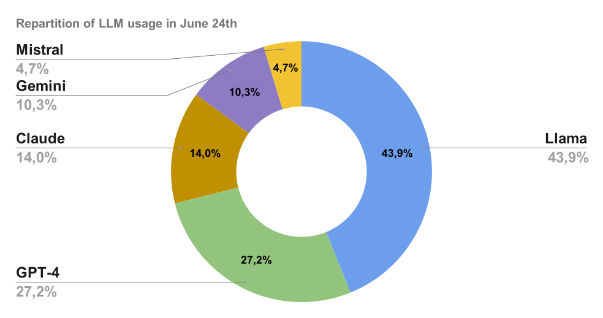

# Introducing the LLM Popularity index

## How are LLM ranked today : performance

Basically, the current way of evaluating LLM performance is based on creating requests, prompt all LLM and evaluate the best answer. It can be automatized when the correct answer is known in advance (like for mathematics tests) or manually evaluated (like for the Chatbot Arena)

1) The elo models of the chatbot arena:  [LMSYS Chatbot Arena and Leaderboard](https://chat.lmsys.org/)

2) The scored benchmarks: [LiveBench](https://livebench.ai/) 

## Why is a popularity index now needed

- LLM ranking is going to be less objective and more personal.
- It’s going to be who I want to get an advice from as we are going to delegate the tasks to LLM at a higher and higher level.
- LLM selection is gonna be less about which models gives the correct answer and more about which model gives me a relevant answer.
- It’s not only about the right answer, the best LLM is now also a matter of personal taste
- It’s about who you want to have an opinion about your problem : it’s not because you don’t follow your advisor recommandation that you don’t want or trust his recommandation
- It’s a percentage and therefore, it is an empirically estimated value

## LLM popularity Index : June 2024th edition

### GPT is leading over Claude & Gemini by a fair advance

- With 27.2% of the total prompts, GPT-4o is leading over his main competitors.
- Claude is prompted on 14% of total requests in June. However, as we demonstrated in a specific study, there was a [huge increase in Claude’s popularity following the release of Claude 3.5 Sonnet on June 20th](https://www.notion.so/Claude-s-popularity-surpasses-GPT-s-following-the-release-of-Claude-3-5-Sonnet-1d0ff5a2c9744e349ddedd0e92ae559c?pvs=21).
- Gemini 1.5 Pro’s popularity was surpassed by Claude’s after the release of Claude 3.5 Sonnet. It represents 10% of total prompts.
- Mistral Large represent 4,7% of total requests

### How should we interpret Llama 3's score?

- Llama 3 was selected as the default LLM in the study ([see methodology below](https://www.notion.so/Introducing-the-LLM-Popularity-index-9df6d1f707964e308bdb9f134874b6f9?pvs=21)). Therefore, the 45% & 47% can’t be considered a mathematically fair metric to evaluate the popularity of Llama 3. It is most likely overestimated.
- However, the outstanding speed of Llama 3 powered by Groq makes it a serious contender for the crown of the most popular AI model. (The Mammouth team selected it as the default LLM because it was their personal favorite).
- The team is considering reviewing the default setup on Mammouth (the interface where the study was conducted) to provide an accurate figure for Llama 3 in our next study.

Will this popularity remain constant or evolve in the future? 

To keep in touch with our next study, follow Mammouth on [LinkedIn](https://www.linkedin.com/company/mammouth-ai) or [X](http://x.com/mammouth_ai).

### **Methodology to evaluate the LLM popularity empirically**

The popularity is evaluated based on the user choices on [Mammouth AI](https://mammouth.ai),  an solution to prompt the top GenAI models in one place.

Prompting interface of Mammouth with access to best LLM versions from GPT, Claude, Mistral, Llama and Gemini

- The top 5 models are displayed together in 5 buttons of the same size.
- When the user clicks on a AI model, they get the selected LLM’s answer to their prompt.
- If the user just presses the “enter” hotkey, they get Llama’s answer.

Conversation interface of Mammouth

After prompting a LLM, the user can also:

- Keep chatting with the selected AI model
- Reprompt their request with another LLM

To evaluate the LLM popularity, we then counted the prompts for each LLM and every user from June 6th to June 30th. 

## LLM Popularity Index : all editions

[LLM Popularity Index since September 2024 are covered here](../the-most-popular-llm/)

## Additional elements

### Documentation

- [Release of Claude 3.5 by Anthropic](https://www.anthropic.com/news/claude-3-family)

### You can try 4 out of the 5 LLMs for free on:

- [Try Llama 3 70B by groq](http://groq.com)
- [Try GPT-4o](http://www.chatgpt.com)
- [Try Mistral Large](https://chat.mistral.ai/chat)
- [Try Claude](https://claude.ai/)

### Or use them all on

- [Mammouth AI](http://mammouth.ai)