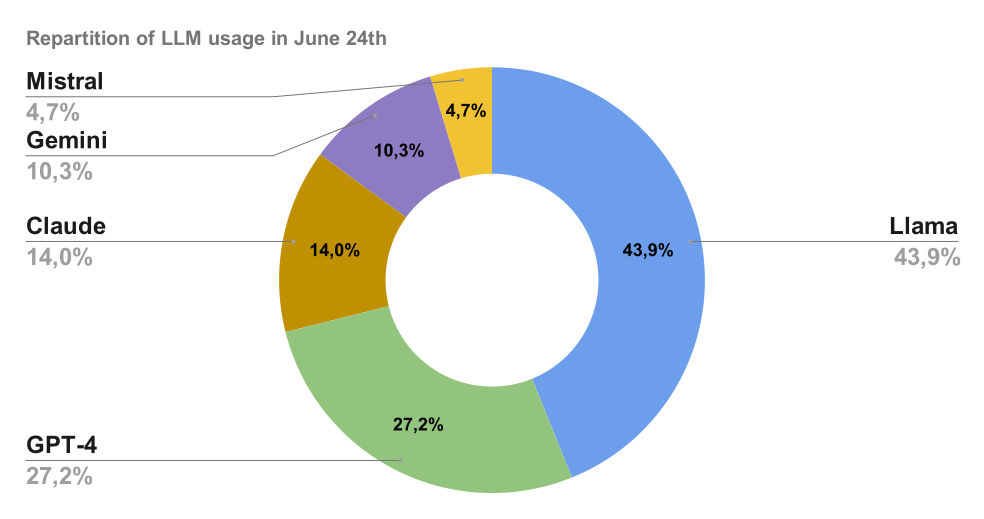

# Présentation de l'index de popularité des LLM

## Comment les LLM sont classés aujourd'hui : performance

Fondamentalement, la façon actuelle d'évaluer la performance des LLM est basée sur la création de requêtes, prompter tous les LLM et évaluer la meilleure réponse. Cela peut être automatisé quand la réponse correcte est connue à l'avance (comme pour les tests de mathématiques) ou évalué manuellement (comme pour la Chatbot Arena)

1) Les modèles elo de la chatbot arena : [LMSYS Chatbot Arena and Leaderboard](https://chat.lmsys.org/)

2) Les benchmarks notés : [LiveBench](https://livebench.ai/) 

## Pourquoi un index de popularité est maintenant nécessaire

- Le classement des LLM va devenir moins objectif et plus personnel.
- Il s'agira de savoir de qui je veux obtenir un conseil car nous allons déléguer les tâches aux LLM à un niveau de plus en plus élevé.
- La sélection des LLM va être moins à propos de quel modèle donne la réponse correcte et plus à propos de quel modèle me donne une réponse pertinente.
- Il ne s'agit pas seulement de la bonne réponse, le meilleur LLM est maintenant aussi une question de goût personnel
- Il s'agit de savoir de qui vous voulez avoir une opinion sur votre problème : ce n'est pas parce que vous ne suivez pas la recommandation de votre conseiller que vous ne voulez pas ou ne faites pas confiance à sa recommandation
- C'est un pourcentage et par conséquent, c'est une valeur estimée empiriquement

## Index de popularité des LLM : édition de juin 2024

### GPT mène devant Claude et Gemini avec une avance confortable

- Avec 27,2% du total des prompts, GPT-4o mène devant ses principaux concurrents.
- Claude est prompté sur 14% du total des requêtes en juin. Cependant, comme nous l'avons démontré dans une étude spécifique, il y a eu une [énorme augmentation de la popularité de Claude suite à la sortie de Claude 3.5 Sonnet le 20 juin](https://www.notion.so/Claude-s-popularity-surpasses-GPT-s-following-the-release-of-Claude-3-5-Sonnet-1d0ff5a2c9744e349ddedd0e92ae559c?pvs=21).
- La popularité de Gemini 1.5 Pro a été dépassée par celle de Claude après la sortie de Claude 3.5 Sonnet. Il représente 10% du total des prompts.
- Mistral Large représente 4,7% du total des requêtes

### Comment devons-nous interpréter le score de Llama 3 ?

- Llama 3 a été sélectionné comme LLM par défaut dans l'étude ([voir méthodologie ci-dessous](https://www.notion.so/Introducing-the-LLM-Popularity-index-9df6d1f707964e308bdb9f134874b6f9?pvs=21)). Par conséquent, les 45% et 47% ne peuvent pas être considérés comme une métrique mathématiquement équitable pour évaluer la popularité de Llama 3. Elle est très probablement surestimée.
- Cependant, la vitesse exceptionnelle de Llama 3 alimenté par Groq en fait un concurrent sérieux pour la couronne du modèle d'IA le plus populaire. (L'équipe Mammouth l'a sélectionné comme LLM par défaut car c'était leur favori personnel).
- L'équipe envisage de réviser la configuration par défaut sur Mammouth (l'interface où l'étude a été menée) pour fournir un chiffre précis pour Llama 3 dans notre prochaine étude.

Cette popularité restera-t-elle constante ou évoluera-t-elle à l'avenir ? 

Pour rester en contact avec notre prochaine étude, suivez Mammouth sur [LinkedIn](https://www.linkedin.com/company/mammouth-ai) ou [X](http://x.com/mammouth_ai).

### **Méthodologie pour évaluer empiriquement la popularité des LLM**

La popularité est évaluée basée sur les choix des utilisateurs sur [Mammouth AI](https://mammouth.ai), une solution pour prompter les meilleurs modèles GenAI en un seul endroit.

Interface de prompting de Mammouth avec accès aux meilleures versions de LLM de GPT, Claude, Mistral, Llama et Gemini

- Les 5 meilleurs modèles sont affichés ensemble dans 5 boutons de même taille.
- Quand l'utilisateur clique sur un modèle d'IA, il obtient la réponse du LLM sélectionné à son prompt.
- Si l'utilisateur appuie juste sur la touche de raccourci "entrée", il obtient la réponse de Llama.

Interface de conversation de Mammouth

Après avoir prompté un LLM, l'utilisateur peut aussi :

- Continuer à chatter avec le modèle d'IA sélectionné
- Reprompter leur requête avec un autre LLM

Pour évaluer la popularité des LLM, nous avons alors compté les prompts pour chaque LLM et chaque utilisateur du 6 juin au 30 juin.

## Index de popularité des LLM : toutes les éditions

[L'index de popularité des LLM depuis septembre 2024 est couvert ici](../the-most-popular-llm/index.md)

## Éléments supplémentaires

### Documentation

- [Sortie de Claude 3.5 par Anthropic](https://www.anthropic.com/news/claude-3-family)

### Vous pouvez essayer 4 des 5 LLM gratuitement sur :

- [Essayer Llama 3 70B par groq](http://groq.com)
- [Essayer GPT-4o](http://www.chatgpt.com)
- [Essayer Mistral Large](https://chat.mistral.ai/chat)
- [Essayer Claude](https://claude.ai/)

### Ou les utiliser tous sur

- [Mammouth AI](http://mammouth.ai)